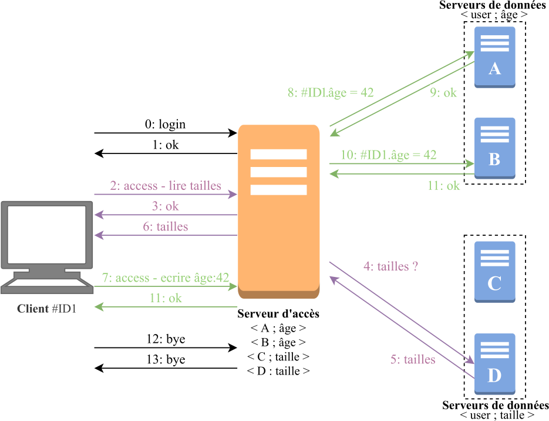

# Introduction

Ce projet a été développé pour le cours de Réseaux S5 de l'UFR Math Info à Strasbourg. Le sujet est:

**Banque de données distribuée avec notions de respect de la qualité privée des données et tolérante aux pannes.**

Pour voir l'énoncé complet, cliquez [ici](enonce.pdf).



# Auteurs

Danyl El-Kabir et François Grabenstaetter

# Licence

Ce projet a été développé sous Licence GNU-GPLv3

# Utilisation

Ce projet est composé de 3 modules: les outils dans common, le programme client, le relais, et le noeud. Il suffit de soit compiler chaque module séparemment soit tout-en-un depuis la racine du projet:

```bash
make
```

Pour la mise en marche, il faut démarrer une instance du serveur relais, puis des noeuds et des clients.

**Serveur relais:**
```bash
./main <port>
```

**Noeud de données:**
```bash
./main <relais_ip> <relais_port> <champ_stocké>
```

**Client:**
```bash
./main <relais_ip> <relais_port> <login> <mdp>
```
